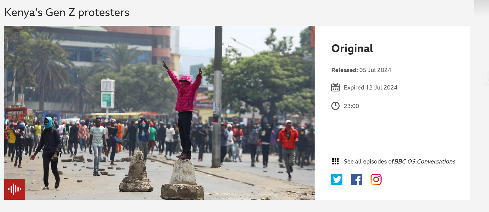

# Kenya Maandamano Visualizations

This is an open-source project for visualizing maandamano (demonstrations) incidents in Kenya using Streamlit.

## Features

- Map-based visualizations of incidents
- Trends and statistics




## Setup

1. Clone the repository:
   ```bash
   git clone https://github.com/KimutaiLawrence/kenya-maandamano-visualizations.git
   cd kenya-maandamano-visualizations
   ```

2. Create and activate a virtual environment:
   ```bash
   python -m venv venv
   
   # On Windows
   venv\Scripts\activate
   
   # On Unix or MacOS
   source venv/bin/activate
   ```

3. Install dependencies:
   ```bash
   pip install -r requirements.txt
   ```

4. Run the app:
   ```bash
   streamlit run app.py
   ```

## Contributing

Contributions are welcome! Feel free to open issues or submit pull requests.

